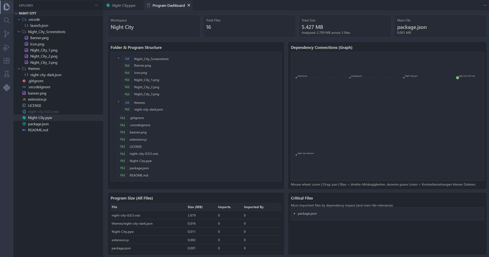

# Project Graph

Project Graph helps you understand a codebase at a glance.
It combines structure, dependency relationships, size analytics, and critical-file insights in a single view inside VS Code.

## What it does

- Shows folder and program structure in a clean tree view
- Visualizes dependency connections between analyzed files
- Reports total workspace file count and total workspace size
- Highlights critical files based on connection impact and entry-point relevance
- Supports focused analysis through configurable file extensions and excluded folders

## Who is it for?

- Developers joining an existing project
- Maintainers cleaning up large repositories
- Teams reviewing architecture and technical debt
- Anyone who wants fast visibility into project structure and file impact

## How to activate it

1. Install the extension in VS Code.
2. Open the project folder you want to analyze.
3. Open the Command Palette (`Ctrl+Shift+P`).
4. Run `Project Graph: Open`.

To refresh data after changes, run `Project Graph: Refresh`.

## Contributing

Contributions are welcome.  
Found a glitch? Wouldnt suprise me.  
This repository contains 20% logic, 30% caffeine and 50% "why does this suddenly work?"  
Send a pull request on GitHub.  

## Thanks

If you want to learn how to create your own extension,  
you can start with the official VS Code guide or lookup some tutorial videos.  
I know reading sucks sometime.  

https://code.visualstudio.com/api/get-started/your-first-extension

## License

This project is licensed under the MIT License.
See [LICENSE](LICENSE) for details.